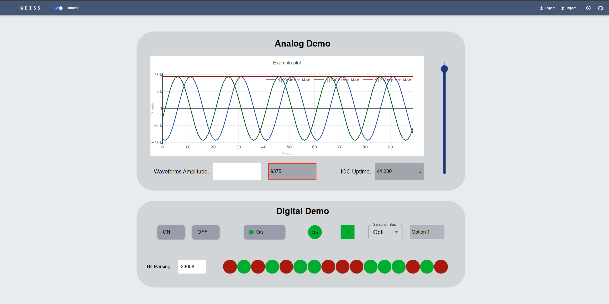

# WEISS - Web EPICS Interface Studio

This is a no-code drag and drop tool for EPICS web operation interfaces.

Follow the app development and mapped improvements on
[WEISS Project Dashboard](https://github.com/users/AndreFavotto/projects/2)

## Dependencies

- Docker (tested with 28.1.1)
- Docker Compose (tested with v2.35.1)

## Launch development version

1. Clone this repo

2. Create your .env: Since we don't yet use secrets or certificates, you can just copy
   [.env.example](./.env.example) into your `.env`.

```
cp .env.example .env
```

3. Launch the app: `docker compose -f docker-compose-dev.yml up`. The application should be
   available in `localhost:5173`.

> If launched via the compose file provided, no further configuration is needed. Tailoring of the
> EPICS communication configurations (default protocol (ca|pva), CA_ADDR_LIST, PVA_ADDR_LIST, etc)
> can be made in your `.env` file.

## Examples

In the [examples folder](./examples/) you will find an EPICS IOC and one OPI ready for you to try
the app.

1. In a machine with EPICS installed, run [exampleIOC](exampleIOC).

   - It is a standard EPICS IOC, so edit the RELEASE file with the path to your BASE and build it.
     Then, run the st.cmd in `iocBoot/iocexample`.
   - Alternatively, just run [example.db](./exampleIOC/exampleApp/Db/example.db) directly with
     softIocPVA: `softIocPVA -d example.db`.
   - Run `dbl` to see the available PVs.

> If you are running the IOC in a different machine than the web app, make sure to edit
> `EPICS_PVA_ADDR_LIST`/`EPICS_CA_ADDR_LIST` with the host address (see [.env](.env.example))

2. Launch WEISS and click in the upload but ton (up arrow in the nav bar). Select the file
   [example-opi.json](./examples/example-opi.json). Edit it as you will. Whenever you are ready,
   clik the "Preview" button to start communication. You should see something similar to this:



## Notes

This is a React + TypeScript application. Several components and elements of the design are based in
[Material UI library](https://mui.com/material-ui/)
